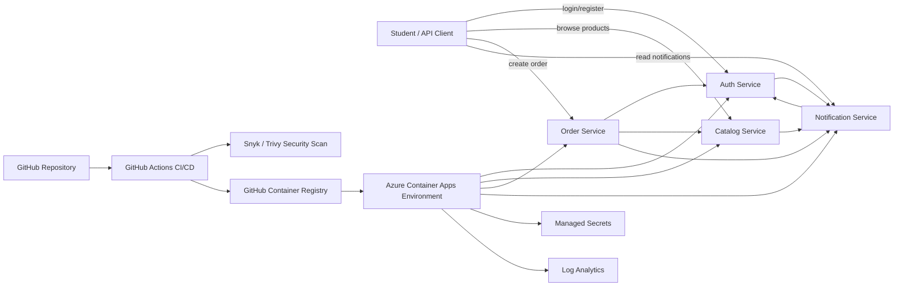

# SmartCart Project Report

## Shared Architecture Diagram

The group application is SmartCart, a small e-commerce ordering platform split into four microservices.

## Assigned Microservice and Rationale

The main assigned service is the `order-service`. Its role is to coordinate the business transaction of placing an order. It accepts an authenticated request, validates the user with `auth-service`, checks product details and reserves stock through `catalog-service`, then asks `notification-service` to queue an order confirmation.

This service was selected because it demonstrates real microservice orchestration. It does not own user identity, product data, or notification delivery. Instead, it depends on other bounded services through HTTP contracts.

## Functionality and Endpoints

`auth-service`

- `POST /auth/register`: create a user account.
- `POST /auth/login`: authenticate and return a signed bearer token.
- `GET /auth/validate`: validate a bearer token for other services.

`catalog-service`

- `GET /products`: list products.
- `GET /products/{id}`: get one product.
- `POST /products`: create a product using an internal API key.
- `POST /catalog/reservations`: reserve stock using an internal API key.

`order-service`

- `POST /orders`: create an order.
- `GET /orders`: list authenticated user's orders.

`notification-service`

- `POST /notifications`: queue a notification from another service using an internal API key.
- `GET /notifications`: list authenticated user's notifications after auth validation.

Every service also exposes `GET /health` and `GET /openapi.json`.

## Inter-Service Communication

The order creation flow demonstrates the required working integration point:

1. The client sends `POST /orders` with a bearer token.
2. `order-service` calls `auth-service` at `GET /auth/validate`.
3. `order-service` calls `catalog-service` at `GET /products/{id}`.
4. `order-service` calls `catalog-service` at `POST /catalog/reservations`.
5. `order-service` calls `notification-service` at `POST /notifications`.

Other integration points are also implemented. `auth-service` queues a welcome notification after registration, `catalog-service` queues an operational notification after product creation, and `notification-service` validates bearer tokens through `auth-service` before exposing user notifications.

## DevOps Practices

The code is designed to be hosted in a public GitHub repository. GitHub Actions performs syntax checks, unit tests, security scanning, Docker image builds, image publishing to GitHub Container Registry, and optional Azure Container Apps deployment.

The pipeline file is `.github/workflows/ci-cd.yml`. It includes:

- `python -m compileall` for syntax validation.
- `python -m unittest discover` for unit and contract tests.
- Trivy filesystem scanning with SARIF upload.
- Optional Snyk scanning when `SNYK_TOKEN` is configured.
- Docker builds for all four service images.
- Optional Azure deployment when Azure secrets are configured.

## Containerization

Each service has a dedicated Dockerfile:

- `services/auth-service/Dockerfile`
- `services/catalog-service/Dockerfile`
- `services/order-service/Dockerfile`
- `services/notification-service/Dockerfile`

The containers run as a non-root user and include health checks. `docker-compose.yml` can run all services locally with the same service URLs used in cloud-style deployment.

## Cloud Deployment

The recommended managed container orchestration platform is Azure Container Apps. It is a managed service suitable for small HTTP containers and can scale to zero for cost control.

Deployment files:

- `deploy/azure-container-apps.bicep`: Azure Container Apps environment and service deployment.
- `deploy/container-app.bicep`: reusable container app module.
- `deploy/kubernetes.yaml`: alternative Kubernetes manifest for AKS or another managed Kubernetes service.

## Security and DevSecOps Practices

Security measures implemented:

- Bearer tokens are HMAC signed by `auth-service`.
- Passwords are salted and hashed before storage.
- Internal service-only write endpoints require `x-api-key`.
- Secrets are read from environment variables, not hardcoded for production.
- Containers run as non-root users.
- HTTP responses include `x-content-type-options: nosniff` and `cache-control: no-store`.
- CI includes Trivy scanning and optional Snyk scanning.
- Azure deployment uses Container App secrets for `TOKEN_SECRET` and `INTERNAL_API_KEY`.
- The architecture separates responsibilities so each service has least-privilege access to only the APIs it needs.

## Challenges and Resolutions

One challenge was keeping the prototype simple enough for a 10-minute demonstration while still showing real integration. This was addressed by using lightweight HTTP services and a single order flow that clearly calls the other services.

Another challenge was making cloud deployment reproducible without relying on one student's local machine. Dockerfiles, GitHub Actions, and Bicep templates were added so the same images can be built, scanned, published, and deployed from the repository.

Security was also balanced with prototype scope. The implementation uses signed tokens, internal API keys, non-root containers, and secret-based configuration while avoiding unnecessary complexity such as a full identity provider.

